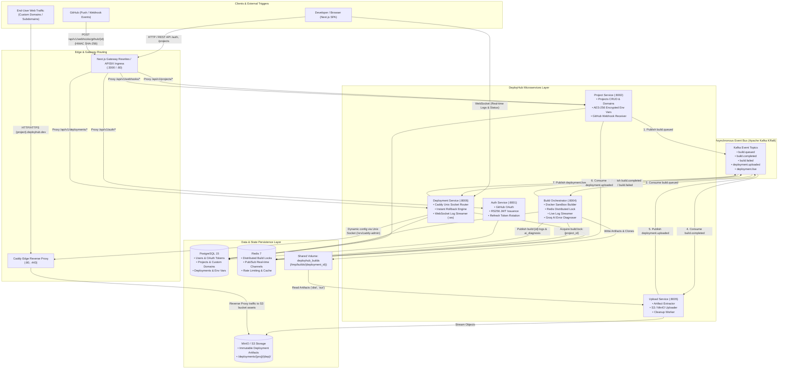
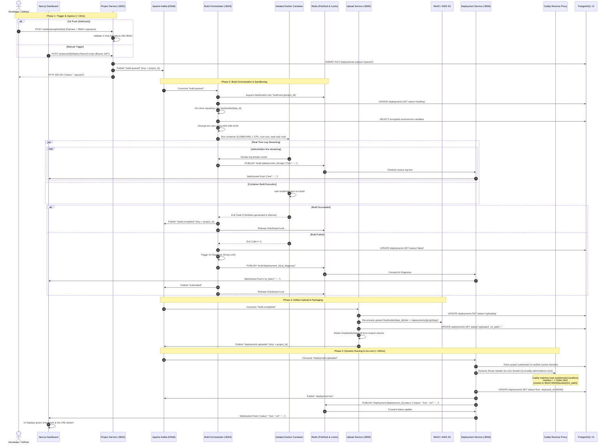
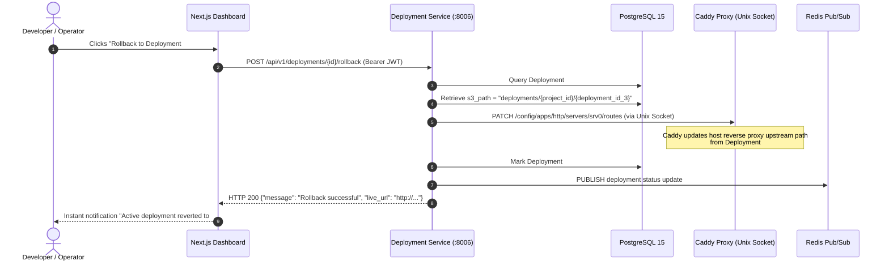

# DeployHub — Architecture & Microservices Flow Diagram

This document illustrates the complete architectural topology and runtime interaction flow of DeployHub, covering the Next.js frontend application, API routing, all 5 core FastAPI microservices, asynchronous Kafka event streaming, and Caddy reverse-proxying.

---

## 1. High-Level Architecture & Traffic Topology

---

## 2. End-to-End Build & Deployment Flow (Choreographed Saga)

---

## 3. Instant Rollback Flow

